# prinx-interface — architecture

**Last verified:** 2026-05-26 (UTC)

Canonical wiring diagram for **agents and humans**. Update when provider order, data ownership, SOR/trade paths, or major module boundaries change (see workspace rule `agent-docs-architecture.mdc`).

**Master data-flow diagram (keep in sync):**

| File                                                             | Purpose                                                                        |
| ---------------------------------------------------------------- | ------------------------------------------------------------------------------ |
| [diagrams/master-data-flow.mmd](./diagrams/master-data-flow.mmd) | Edit the graph here first (source of truth)                                    |
| §11 below                                                        | Same Mermaid for agents, GitHub, and Markdown preview (with Mermaid extension) |

When the master diagram changes, update `.mmd` and §11 in one pass (see `agent-docs-architecture.mdc`).

**Preview in Cursor:** install recommended extensions from [`.vscode/extensions.json`](../.vscode/extensions.json) — open `.mmd` with **Mermaid Preview**, or `architecture.md` §11 with **Markdown Preview** (see [guide.md](./guide.md)).

Related policy: [positions-share-sources.md](./positions-share-sources.md) (venue share count sources).

---

## 1. System context

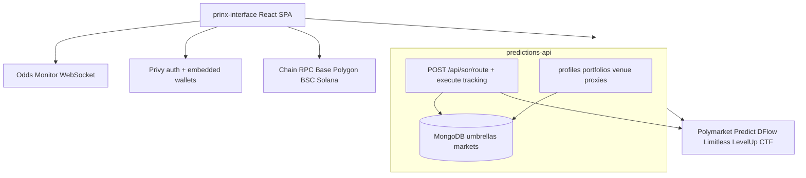

| Repo                | Role                                                                     |
| ------------------- | ------------------------------------------------------------------------ |
| **prinx-interface** | React UI, client SOR orchestration, on-chain reads where policy allows   |
| **predictions-api** | Private API, SOR route compute, Mongo catalog, server-side venue proxies |
| **Odds Monitor**    | Live orderbook / odds WebSocket feed                                     |

---

## 2. Bootstrap & provider tree

Mount order from [`src/index.tsx`](../src/index.tsx):

```text
Router
  PrivyProvider + SmartWalletsProvider
    WalletProvider (TanStack QueryClient)
      EnabledVenuesProvider
        PredictionDataProvider          ← public market catalog
          OddsMonitorProvider
            SignerProvider              ← account / signerAddress
              AccountDataProvider       ← profile, VACM, venue accounts, positions.* (incl. LevelUp RPC)
                (nested CollateralTokenProvider → GET /portfolio/cash-summary only)
                PositionsRouteChunkPreloader
                UserDataProvider        ← Mixpanel identify only (no trading data)
                  SetupActivationProvider
                    venue background activators (Poly / Predict / Limitless / Poly deploy)
                    FirstSignupSetupGate
                    RecentSettlementClaimProvider
                      PostTradeAccountSyncProvider
                        PositionsDataProvider   ← Positions page assembly + MTM summary
                          PortfolioProvider     ← header cash + positions total
                            … UI providers …
                              App
```

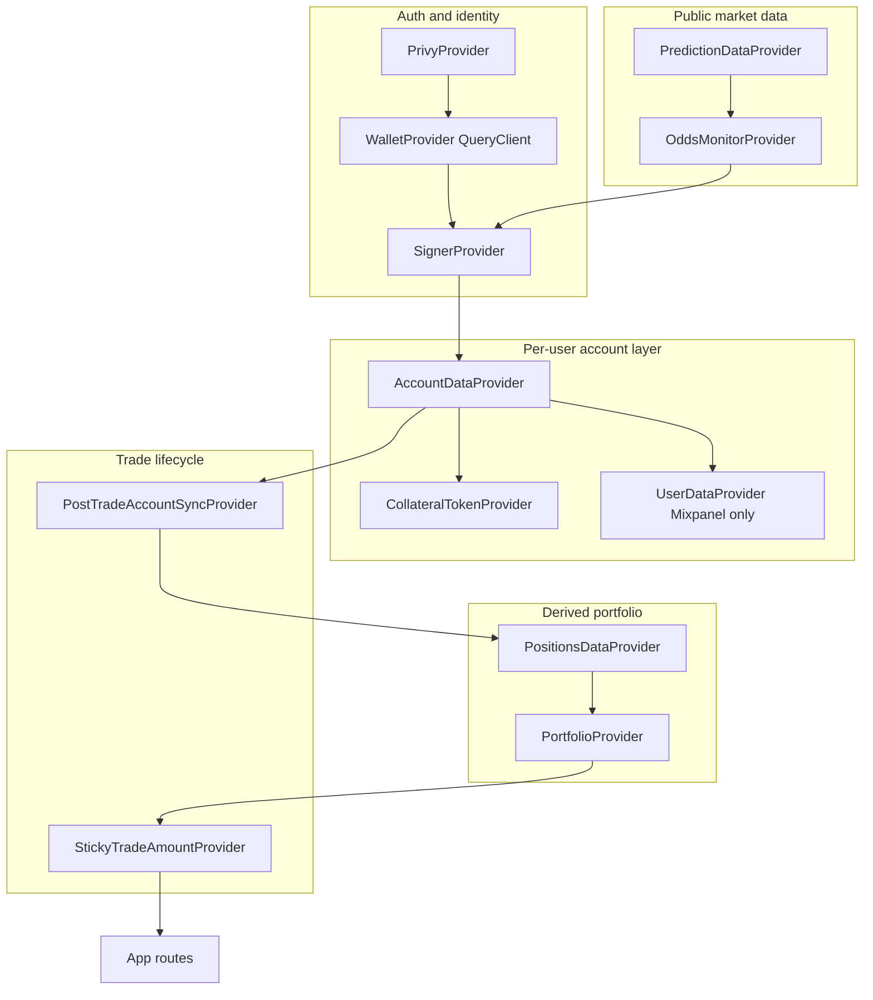

**Key rule:** Positions page and trade box **do not read from each other**. They subscribe to the same contexts/hooks (shared TanStack `queryKey`s where applicable).

---

## 3. Public vs per-user data

| Layer             | Owner                                | Source                                                                 | Examples                                                       |
| ----------------- | ------------------------------------ | ---------------------------------------------------------------------- | -------------------------------------------------------------- |
| Market catalog    | `PredictionDataContext`              | `GET /umbrellas`, orderbook fetches, tags                              | umbrellas, questions, orderbooks                               |
| Live odds         | `OddsMonitorContext`                 | WebSocket                                                              | book updates                                                   |
| Identity          | `SignerProvider`                     | Privy                                                                  | `account`, `signerAddress`                                     |
| Cash (stables)    | `CollateralTokenProvider`            | `GET /portfolio/cash-summary`                                          | header cash, SOR funding input                                 |
| Venue positions   | `AccountDataContext` → `positions.*` | venue REST / API proxy / server RPC; LevelUp = Base CTF RPC in browser | see [positions-share-sources.md](./positions-share-sources.md) |
| Positions UI rows | `PositionsDataProvider`              | `usePositionsData` assembler                                           | Positions page tables + summary MTM                            |
| Header total      | `PortfolioProvider`                  | `cash + positionsTotalValue` from above                                | portfolio chip                                                 |

---

## 4. Per-user data flow

### Mental model

1. **Identity** — almost every user-scoped query keys off `SignerProvider` or `/profiles/me` → `profileId`.
2. **Account store** — `AccountDataContext` + TanStack owns profile, VACM, venue accounts, and all venue position slices (including LevelUp `positions.levelup` via `useLevelUpPositions` → `GET /api/levelup/positions`). Cash is mapped from nested `CollateralTokenProvider`. LevelUp approvals are venue hooks (`useLevelUpApprovalGate`), not a separate context store.
3. **Portfolio header** — `PortfolioProvider` derives `portfolioTotal = cashBalance + positionsTotalValue`; `positionsTotalValue` comes from `PositionsDataProvider` (single MTM source for header).

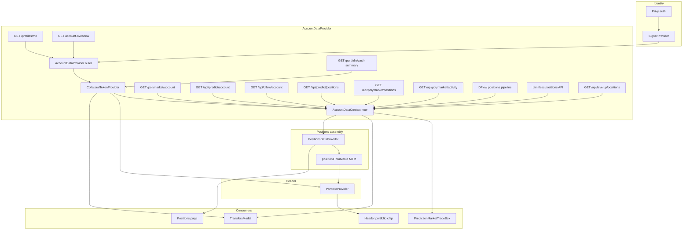

### Quick import reference

| Need                                    | Import                                                                                         |
| --------------------------------------- | ---------------------------------------------------------------------------------------------- |
| LevelUp YES/NO shares                   | `useAccountLevelUpPositions()` or `useAccountData().positions.levelup`                         |
| LevelUp USDC / CTF approvals            | `useLevelUpApprovalGate` / `useLevelUpApprovalsStatus` → `POST /chain/read` (`venue: levelup`) |
| Per-wallet stable snapshot              | `useCollateralTokens()` or `useAccountCash()`                                                  |
| Profile / overview / venue account rows | `useAccountData()`                                                                             |
| Positions page rows + summary MTM       | `usePositionsPageData()`                                                                       |
| Header portfolio total + cash           | `usePortfolio()`                                                                               |
| Trade box all-venue share strip         | `useTradeBoxShareBalances`                                                                     |

---

## 5. Trade box + SOR (end-to-end)

UI shell: [`src/components/PredictionMarketTradeBox/`](../src/components/PredictionMarketTradeBox/). Logic: [`src/features/trading/trade-box/`](../src/features/trading/trade-box/).

**Single path** for quote and execute — no parallel DFlow quote hook.

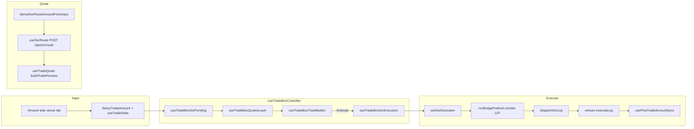

### Trade box controller layers

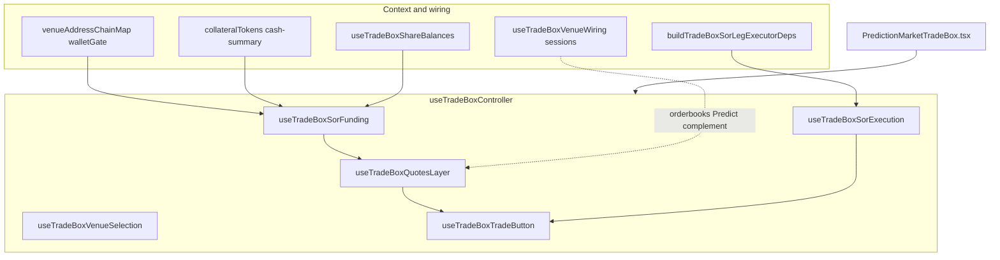

| Hook                      | Responsibility                                                                                          |
| ------------------------- | ------------------------------------------------------------------------------------------------------- |
| `useTradeBoxSorFunding`   | `buildChainBalances` from VACM + cash → `walletBalances` on route request; venue position rows for sell |
| `useTradeBoxQuotesLayer`  | Debounced `useSorRoute` (`includeDflowPondQuote` for DFlow/all); merges into `useTradeQuote`            |
| `useTradeBoxSorExecution` | `useSorLegExecutor` + `useSorExecution` + execute actions                                               |
| `useTradeBoxTradeButton`  | `useButtonState` / `venueButtonState` — gates on VACM, cash, KYC, route errors                          |

---

## 6. SOR client modules

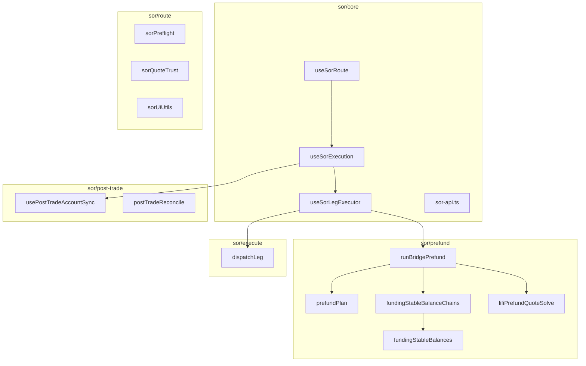

### Unified quote (client + server)

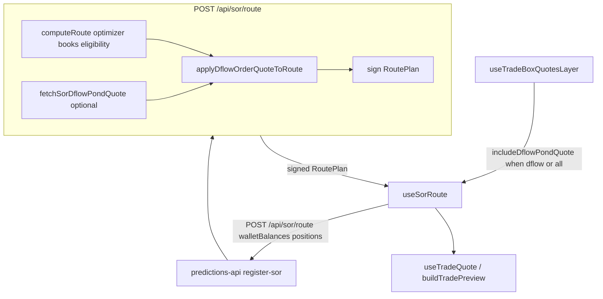

**Removed:** client `useDflowOrderQuote`, server `GET /api/dflow/order/quote`. DFlow execution still uses `GET /api/dflow/order` at leg time.

### Execute path

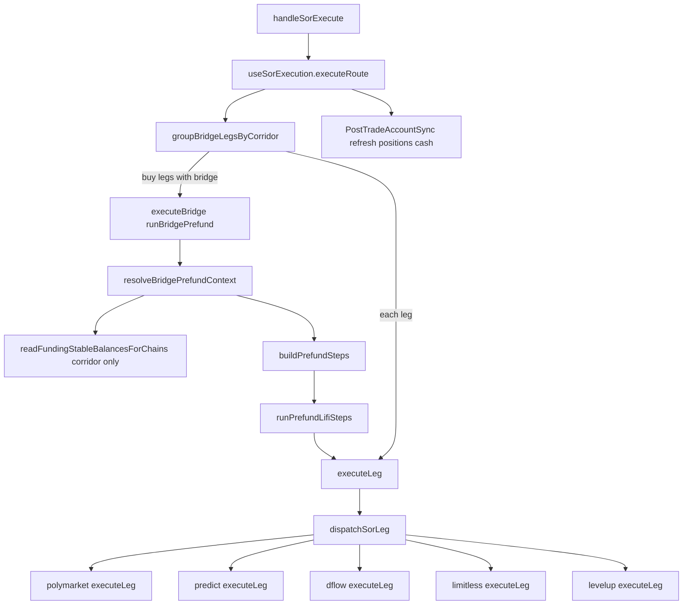

**Prefund corridor:** SOR planner sets `leg.bridge.fromChain` → `toChain`. Execute reads balances only for that corridor (`chainsForBridgeCorridor`). LiFi uses `allowedSourceChains: [bridge.fromChain]`.

| fromChain | LiFi fromAddress (VACM) | Notes                                           |
| --------- | ----------------------- | ----------------------------------------------- |
| base      | SCW or Limitless maker  | Optional same-chain SCW→maker sweep before LiFi |
| polygon   | Polymarket deposit safe | May use Poly relay for signing                  |
| bnb       | Embedded EOA            | USDT on BSC                                     |
| solana    | Solana embedded         | Privy Solana sign                               |

**LI.FI prefund runbook** (server-side detail): `predictions-api/docs/PREFUND_LIFI_STATUS_RUNBOOK.md` in the predictions-api repo.

---

## 7. VACM (venue address chain map)

Privy alone does not produce VACM. `AccountDataProvider` merges profile/overview/venue account slices, then `accountWallets.ts` → `normalizeWalletRolesFromOverview` → `buildVenueAddressChainMap`.

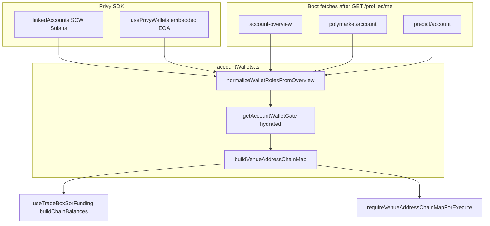

| Role               | Primary source                        | Fallback                               |
| ------------------ | ------------------------------------- | -------------------------------------- |
| baseSmartWallet    | overview smart wallet row             | Privy smart_wallet linked account      |
| embeddedEoa        | Privy embedded EOA                    | —                                      |
| polymarketSafe     | polymarket/account safeWalletAddress  | overview polymarket fundingDestination |
| polygonSigner      | polymarket/account signerAddress      | embeddedEoa                            |
| predictMaker       | predict/account makerAddress          | overview → embeddedEoa                 |
| limitlessMakerBase | overview limitless fundingDestination | —                                      |
| solanaAddress      | Privy Solana wallet                   | overview / linkedAccounts              |

| Venue      | Chain   | walletAddress | signerAddress      |
| ---------- | ------- | ------------- | ------------------ |
| levelup    | base    | SCW           | SCW                |
| limitless  | base    | embedded EOA  | embedded EOA       |
| polymarket | polygon | deposit safe  | polygon signer EOA |
| predictfun | bnb     | predict maker | embedded EOA       |
| dflow      | solana  | solana wallet | same               |

### RPC networks vs wallets

JSON-RPC chains (Base, Polygon, BSC, Solana) are **transport**. VACM is **who signs and where collateral sits**. Limitless and LevelUp both use Base RPC but different wallets.

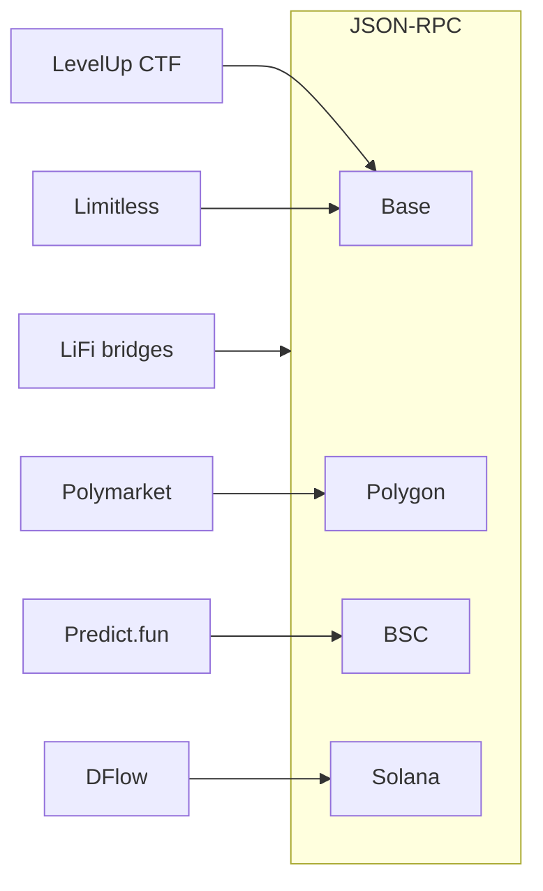

---

## 8. Module directory map

```text
src/
├── index.tsx                    provider tree entry
├── app/                         App routes shell
├── components/
│   └── PredictionMarketTradeBox/  trade UI shell (~940 lines)
├── context/                     React contexts (Account, User, Portfolio, …)
├── features/
│   ├── trading/
│   │   ├── trade-box/           controller, quotes, venue wiring
│   │   ├── sor/                 client SOR (core, prefund, post-trade, execute)
│   │   └── venues/              polymarket predict dflow limitless levelup
│   ├── positions/               Positions page hooks and assemblers
│   └── onboarding/              setup activation gate
├── services/                    private API client, wallets
└── config/                      RPC, addresses

predictions-api/ (sibling repo)
├── api/private-api/sor/         POST /api/sor/route + execute tracking
└── src/sor/                     route compute, DFlow pond overlay
```

---

## 9. Known gaps (May 2026)

- **Wallet gate incomplete** — `isTradeFundingReady` / button state partial in some paths.
- **Predict success UX** — toast on HTTP 201 without mandatory fill confirmation.
- **LiFi stale quote** — deadline can expire between quote and SCW estimate; re-quote before send not implemented.

---

## 10. Verify after architecture changes

```bash
cd prinx-interface
yarn build:strict
```

Targeted tests when touching SOR or prefund:

```bash
npx vitest run src/features/trading/sor/tests/prefundPlan.test.ts \
  src/features/trading/sor/tests/fundingStableBalanceChains.test.ts
```

---

## 11. Master data-flow diagram (reference)

**Preview:** open [diagrams/master-data-flow.mmd](./diagrams/master-data-flow.mmd) and run the Mermaid Preview command, or preview this file with **Markdown Preview Mermaid Support** (see [guide.md](./guide.md)).

The block below is a copy of the `.mmd` source for agents and GitHub.

Read this diagram **top → bottom, left → right**:

1. **External sources** — what the client calls directly (HTTP, WebSocket, RPC, Privy). Upstream venue APIs reached only via predictions-api are not separate nodes here (same as Predict/Limitless positions).
2. **React stores** — contexts and TanStack Query caches that own fetched data (not UI components).
3. **UI consumers** — screens/widgets that _subscribe_ to stores (they do not fetch from each other).
4. **Trade path** — quote → execute → post-trade refresh (orthogonal to catalog/positions reads).

Solid arrows = primary data ownership or fetch direction. Dashed arrows = read/subscribe or refresh after trade.

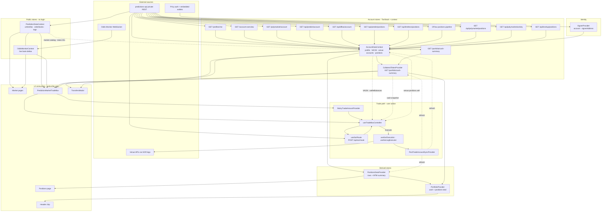

### Node legend

| Node kind   | Examples                                      | Rule                                                      |
| ----------- | --------------------------------------------- | --------------------------------------------------------- |
| **Source**  | `predictions-api`, Privy, venue SOR legs      | What the client calls directly over the network           |
| **Store**   | `AccountDataContext`, `PositionsDataProvider` | Owns fetch or cache; keyed by user/profile/wallet         |
| **Derived** | `PortfolioProvider`                           | Computed from other stores — no independent fetch         |
| **UI**      | Trade box, Positions page, Header             | Reads hooks/context only; never the sole owner of a fetch |

### Same data, multiple subscribers

`AccountDataProvider`, `PositionsDataProvider`, `useTradeBoxShareBalances`, and `PortfolioProvider` may all call the same venue position hooks. That creates multiple React subscriptions but **one TanStack `queryKey` fetch** until invalidation or stale refetch.

Server counterpart for SOR route compute and private API routes: [predictions-api/agent-docs/architecture.md](../../predictions-api/agent-docs/architecture.md).
