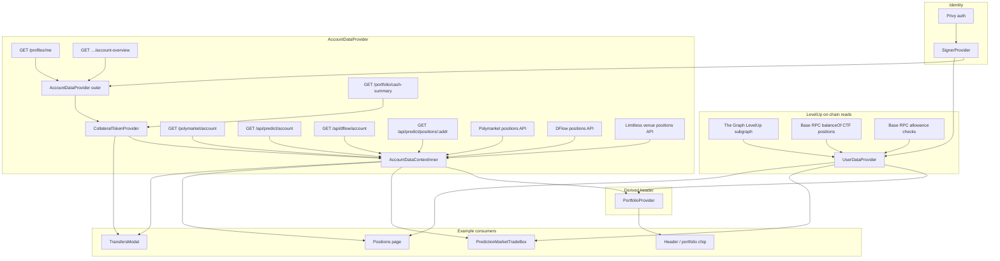

# Individual user data: where it is pulled and where it is used

This document maps **per-user** data only: balances, cash, allowances, venue accounts, and position-like reads. It is not a full app architecture diagram (no public market catalog, no orderbook WebSockets unless they carry *your* positions).

---

## Mental model

1. **Identity** — `SignerProvider` resolves the connected wallet (`account`, `signerAddress`). Almost every user-scoped query keys off these or off `/profiles/me` → `profileId`.

2. **Two big client stores (not one)**  
   - **`UserDataContext`** — LevelUp **CTF share balances** (YES/NO per market) and **LevelUp exchange approvals** (USDC / CTF / fee wrapper on Base).  
   - **`AccountDataContext`** + **TanStack Query** — server “account” APIs (profile, overview, Polymarket / Predict / DFlow account rows, **venue position lists**).  
   **`CollateralTokenProvider`** is **nested inside** `AccountDataProvider` and is the **only** place that runs the `GET /portfolio/cash-summary` query. `AccountDataContext` maps `useCollateralTokens()` into `useAccountData().cash` (same numbers, one HTTP).

3. **Filtering, not forking** — The Positions page and the trading widget **do not read from each other**. They **subscribe to the same hooks / context** (and thus the same TanStack cache keys where applicable). Aggregation logic differs per screen.

---

## Provider order (simplified)

Relevant stack from [`src/index.tsx`](../src/index.tsx):

```text
WalletProvider (QueryClient)
  → PredictionDataProvider / OddsMonitorProvider
    → SignerProvider
      → AccountDataProvider (outer: profile / overview / poly / funding)
          → CollateralTokenProvider   ← ONLY GET /portfolio/cash-summary
              → AccountDataContextInner   ← maps useCollateralTokens → useAccountData().cash
                  → UserDataProvider      ← LevelUp tokenBalances, approvals, orders
                    → … activators …
                      → PostTradeBalanceSyncProvider
                        → PortfolioProvider
                          → App / routes
```

---

## Diagram: pulls → stores → consumers



---

## Table A — Cash (USDC / stables across wallets)

| Pulled from | Owner / cache | Primary API / mechanism | Used by (examples) |
|-------------|---------------|---------------------------|-------------------|
| Private API cash snapshot | **`CollateralTokenProvider` only** (nested in `AccountDataProvider`; TanStack key `collateral-tokens` + `profileId` + `account`) | `GET /portfolio/cash-summary` via `privateApi.getCashSummary()` | `useCollateralTokens()`; **`useAccountData().cash`** is a mapped view of the same snapshot |
| Optimistic bumps after trade | In-memory overlays keyed in `collateralTokensOptimisticOverlays` | Not a network pull — patches query data | Same consumers after SOR / trade completes |

---

## Table B — LevelUp **share** balances (CTF outcome tokens on Base)

| Pulled from | Owner | Primary API / mechanism | Used by (examples) |
|-------------|-------|-------------------------|-------------------|
| LevelUp subgraph account entity | **`UserDataContext`** `tokenBalances: Map<marketId, {yes,no}>` | `subgraphService` → mapped to markets from `PredictionDataContext` | `getTokenBalance(marketId)`, **`useTradeBoxShareBalances`** (LevelUp leg), **`PortfolioProvider`** (marks), Positions assemblers that read `useUserData()` |
| Refresh / subgraph lag | **`UserDataContext`** `refreshTokenPositions()` | Base **RPC** `balanceOf` per outcome token (when subgraph path insufficient) | Trade box after fills; manual refresh flows |

---

## Table C — **Allowance** checks (LevelUp CLOB / exchange on Base)

| Pulled from | Owner | Mechanism | Used by (examples) |
|-------------|-------|-----------|---------------------|
| On-chain read contracts | **`UserDataContext`** `checkApproval()` | `ethers` `Contract` on read provider: USDC `allowance` → exchange + fee wrapper; CTF `isApprovedForAll` → exchange | `PredictionMarketTradeBox` (lazy `checkApproval` on mount), `approveToken()` for the approval CTA |

Venue-specific approvals (Predict BSC, Polymarket, etc.) live in **separate hooks** (e.g. `usePredictApprovalsStatus`, Polymarket builder flows), not inside `UserDataContext`.

---

## Table D — **Venue positions** (Polymarket, Predict, DFlow, Limitless)

| Pulled from | Hook / owner | HTTP / source (conceptually) | Used by (examples) |
|-------------|--------------|------------------------------|---------------------|
| Same TanStack observers | `usePolymarketPositions(safe)` | Polymarket-facing API / client used in hook | `AccountDataProvider`, **`useTradeBoxShareBalances`**, **`PortfolioProvider`**, **`usePositionsData`** bundles |
| Same TanStack observers | `usePredictPositions(address)` | `GET /api/predict/positions/…` (private API) | Same list as above; address from `resolvePredictAccountAddress(signer, account)` |
| Same TanStack observers | `useDflowPositions` / `useLimitlessVenuePositions` | Private API + Solana where applicable | Same |

**Important:** `AccountDataProvider`, `PortfolioProvider`, and `useTradeBoxShareBalances` each **call these hooks again**. That is multiple **React** subscriptions, but **identical `queryKey`s ⇒ one underlying fetch** per user/wallet until invalidation or stale refetch.

---

## Table E — **Account / profile** (who you are, where money routes)

| Pulled from | Owner | API | Used by (examples) |
|-------------|-------|-----|---------------------|
| Profile | `AccountDataProvider` → `useCurrentProfile` | `GET /profiles/me` | `useAccountData().profile`, Profile / Comments, cache keys |
| Overview wallets | `useAccountOverview(profileId)` | `GET …/account-overview` | Funding address derivation (`useFundingAddresses` / `useFundingAddressesFromQueries`), SOR readiness |
| Polymarket account row | `usePolymarketBuilder` | `GET /polymarket/account` | Builder / deposit flows, wallet display |
| Predict account row | inline query in `AccountDataProvider` | `GET /api/predict/account` | Execution readiness, trade box ensure |
| DFlow Proof / account | `useDflowProofStatus` | `GET /api/dflow/account` | DFlow gating, Solana link |

---

## Trading widget vs Positions page (your exact question)

| Concern | Shared? | How |
|---------|---------|-----|
| LevelUp YES/NO shares | Yes | Both use **`UserDataContext.getTokenBalance` / `tokenBalances`** |
| Predict / Poly / DFlow / Limitless shares | Same data, different math | Both use **`usePredictPositions`**, **`usePolymarketPositions`**, etc. → **same TanStack cache** |
| Cash USD totals | Yes | **`useCollateralTokens()`** owns the fetch; **`useAccountCash()`** reads the same snapshot via `AccountDataContext` |
| “One pull only” | Cash yes | **One** `GET /portfolio/cash-summary` per cache key. Venue position hooks may still dedupe separately across subscribers. |

---

## Quick reference — import when you need…

| Need | Import |
|------|--------|
| LevelUp market YES/NO shares | `useUserData()` → `getTokenBalance` / `tokenBalances` |
| LevelUp USDC / CTF approvals | `useUserData()` → `checkApproval` / `approvalState` / `approveToken` |
| Per-wallet fiat/stable snapshot | `useCollateralTokens()` or `useAccountCash()` |
| Profile / overview / predict account | `useAccountData()` or scoped selectors in `AccountDataContext.tsx` |
| Header portfolio total + cash line | `usePortfolio()` |
| Trade box all-venue share strip | `useTradeBoxShareBalances` (composes UserData + venue hooks) |

---

*Generated for onboarding and audits. Update when adding a new per-user fetch so this file stays the map of “where did this number come from?”*
